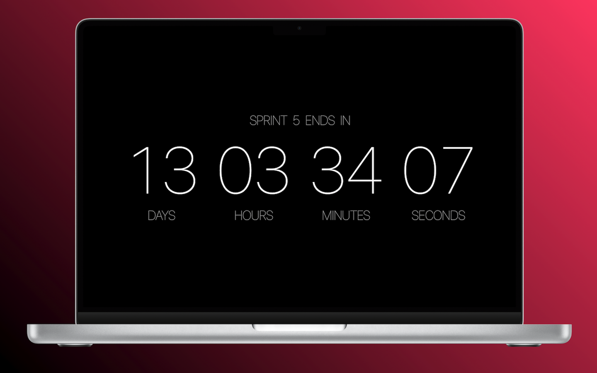
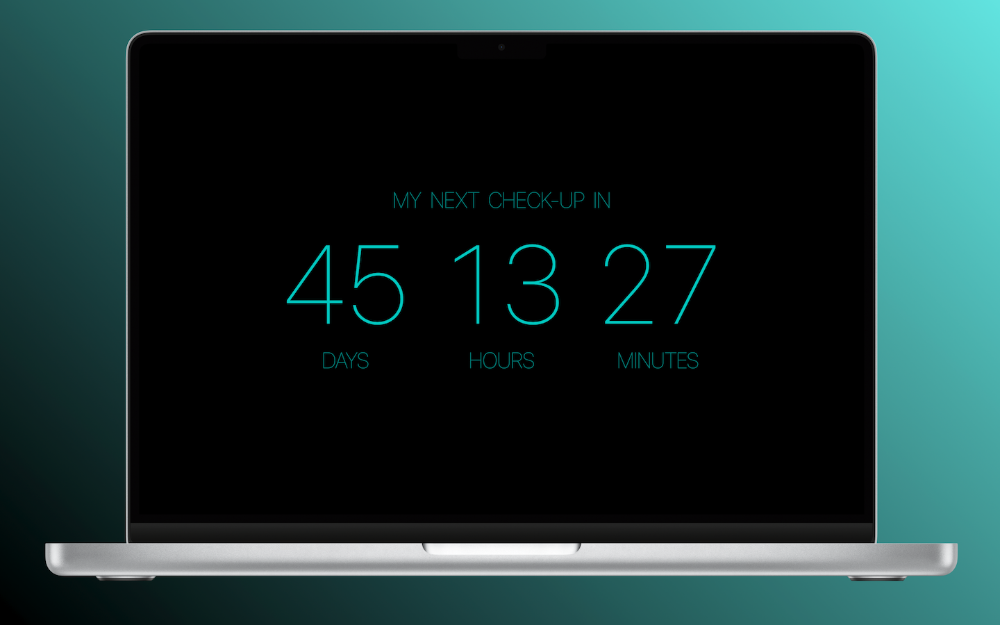
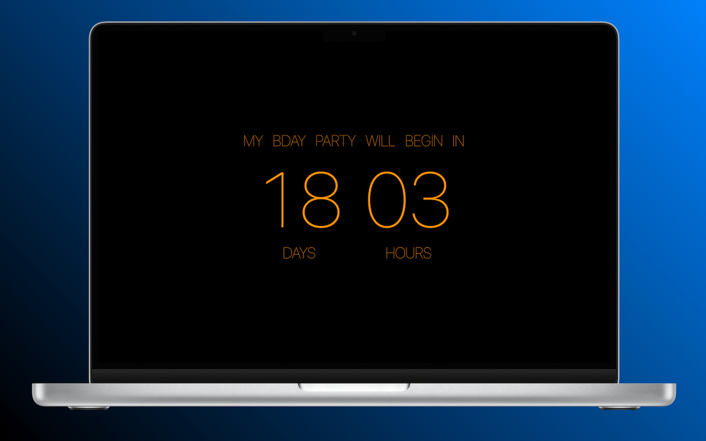
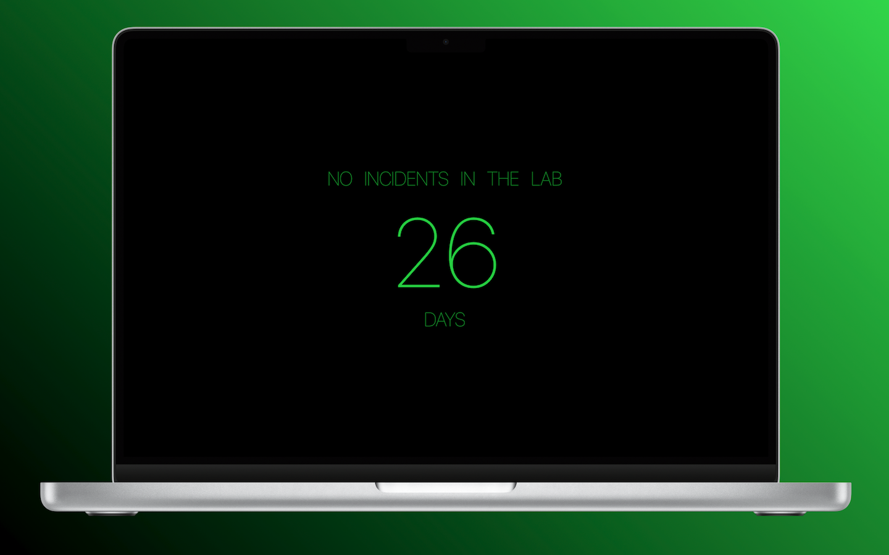
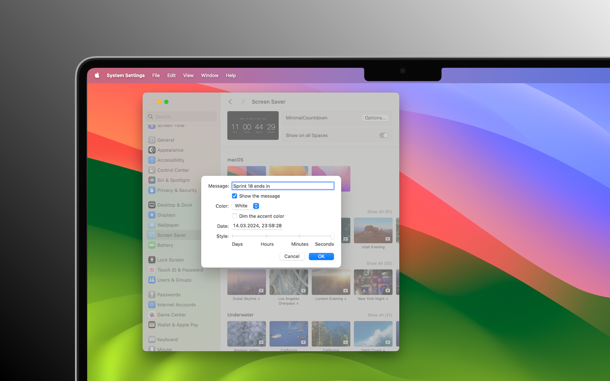

## Minimal Countdown screensaver (macOS) v1.1

Minimal Countdown is a minimalistic countdown screen saver for macOS. Shows the timer while you take a rest for a while. 

Last release notes [read here](https://github.com/SKemenov/MinimalCountdown/releases).

## Features

- [x] Use `Options...` to customize the screen saver
- [x] Set the date and time for your timer (if the date is in the past, the timer increases)
- [x] Add a short message to display above the timer
- [x] Show or hide the message
- [x] Change text color
- [x] Dim the color if you like
- [x] Select a style for your timer to display days, hours, minutes and even seconds
- [x] Localization - English

## Compatibility
Minimal Countdowns screen saver requires OS X Ventura or later.

## Stack 
`Swift only`, `no storyboards`, `AppKit`, `ScreenSaver`, `ScreenSaverDefaults`

## Downloads
### [Minimal Countdown Screen Saver (.zip)](https://github.com/SKemenov/MinimalCountdown/releases/download/1.1/MinimalCountdown.saver.zip)

## How to install
1. Unzip and install it (now without any Gatekeeper warnings)
2. You can choose to install this screen saver only into your account or for all users
3. Customize the settings to fit your imagination
4. Enjoy it!

## Configurations

## How to re-install
1. Delete screen saver in `System Settings` (right-click && `Delete "MinimalCountdown"` && `Move to Trash`)
2. Close `System Settings` window
3. Restart WallpaperAgent `killall kill WallpaperAgent` via the Terminal (or just restart you computer)
4. Install the new version of `MinimalCountdown.ssaver`

## I appreciate your ideas!

- [Sam Soffes](https://github.com/soffes/Countdown)
- [Aerial](https://github.com/AerialScreensaver/ScreenSaverMinimal)
- [Mirko Fetter](https://github.com/mirkofetter/ScreenSaverMinimal/tree/master)
- [Eskil Gjerde Sviggum](https://github.com/Eskils/JellyfishSaver)
- `Apple docs`, `stack overflow` and `medium`.
