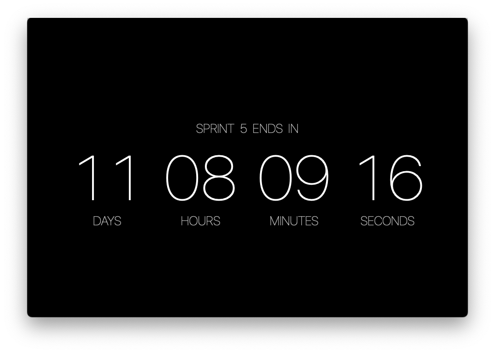
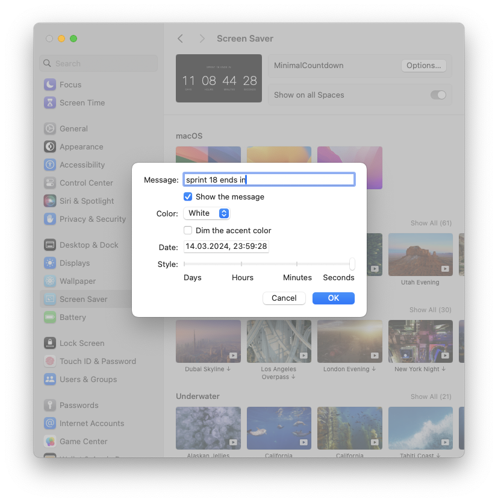

## Minimal Countdown (macOS)

Minimal Countdown is a minimalistic countdown screen saver for macOS. Shows the timer while you take a rest for awhile. 

## Features

- [x] Use `Options...` to customize the screen saver
- [x] Set the date and time for your timer (if the date is in the past, the timer increases)
- [x] Add a short message to display above the timer
- [x] Show or hide the message
- [x] Change text color
- [x] Dim the color if you like
- [x] Select a style for your timer to display days, hours, minutes and even seconds
- [x] Localization - English

## Configurations

## Compatibility
Minimal Countdowns screen saver requires OS X Ventura or later.

## Stack 
`Swift only`, `no storyboards`, `AppKit`, `ScreenSaver`, `ScreenSaverDefaults`

<!---
## Downloads
### [Screen Saver](Releases/1.8/screensaver.zip)
Double-click to install.
--->

## How to build
1. Clone the git
2. Open the project in Xcode and build it
3. Make an archive and take `MinimalCountdown.ssaver` from there 
4. Double-click `MinimalCountdown.ssaver` file to add it into the `System Settings`

## How to re-install
1. Delete screen saver in `System Settings` (right-click && `Delete "MinimalCountdown"` && `Move to Trash`)
2. Close `System Settings` window
3. Restart WallpaperAgent `killall kill WallpaperAgent` via the Terminal
4. Install the new version of `MinimalCountdown.ssaver`

## I appreciate your ideas!

- [Sam Soffes](https://github.com/soffes/Countdown)
- [Aerial](https://github.com/AerialScreensaver/ScreenSaverMinimal)
- [Mirko Fetter](https://github.com/mirkofetter/ScreenSaverMinimal/tree/master)
- [Eskil Gjerde Sviggum](https://github.com/Eskils/JellyfishSaver)
- `Apple docs`, `stack overflow` and `medium`.
