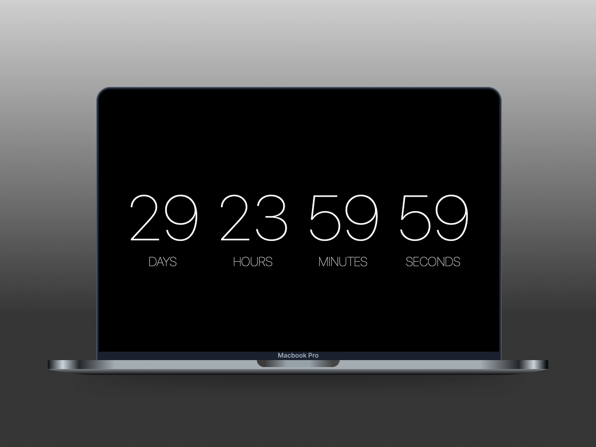
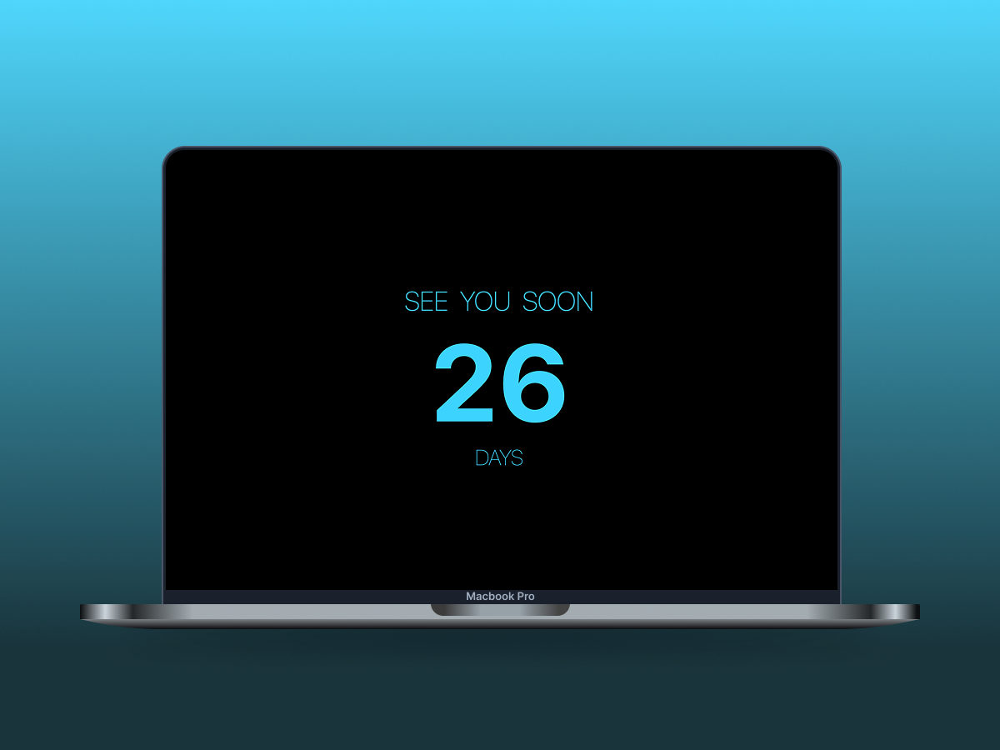
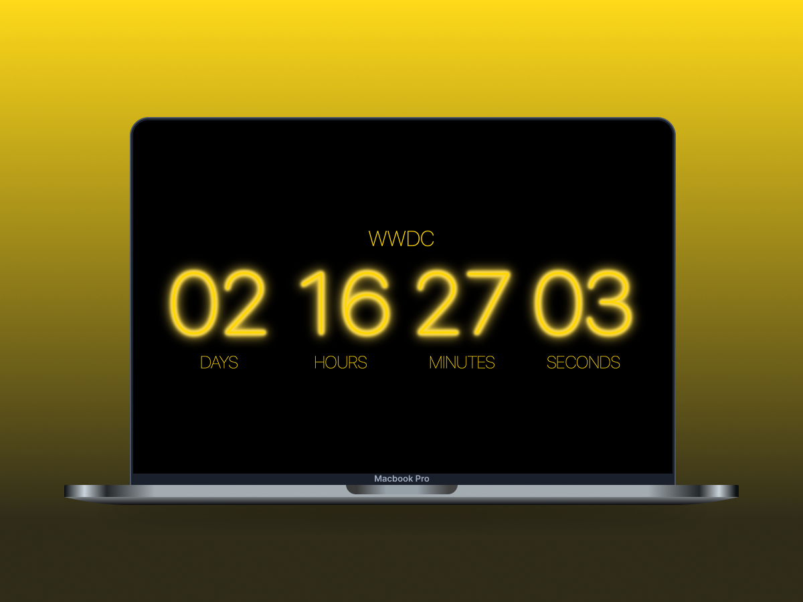
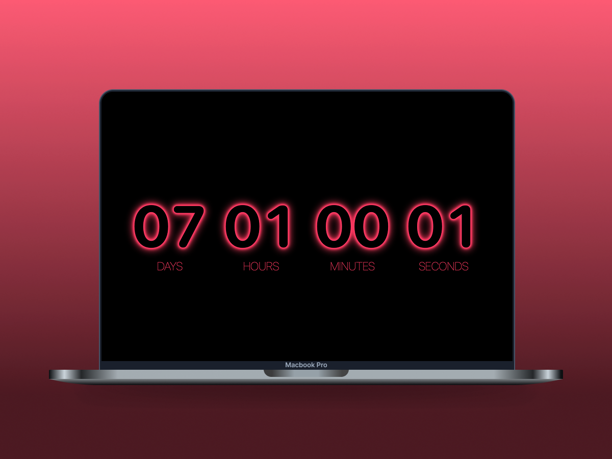
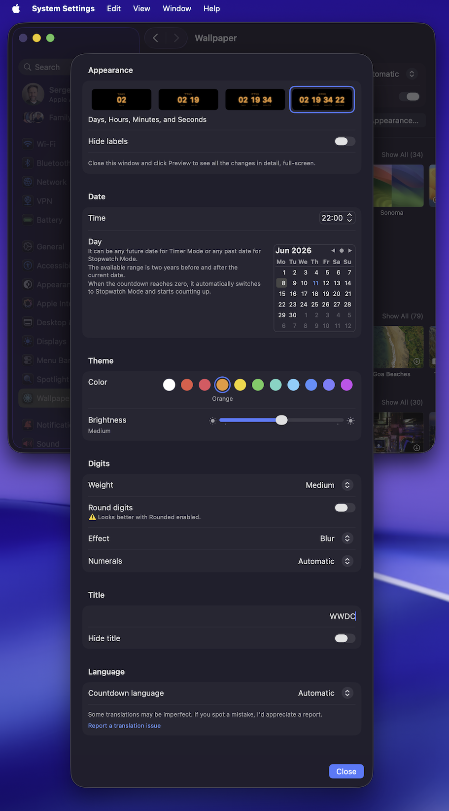

## Minimal Countdown screensaver (macOS) v2.0.0

Minimal Countdown is a minimalistic countdown screen saver for macOS. It counts down to — or up from — a date you choose, ticking quietly while your Mac rests.

Last release notes [read here](https://github.com/SKemenov/MinimalCountdown/releases).

   
   
   
   

## Features

- [x] The totally redesigned Settings window, opened from `Options…`, allows you to customize the screensaver as you want
- [x] The screensaver's now using a separate file to store its settings; you may duplicate it across multiple Macs.
- [x] Set the target date and time — counts down to a future date, counts up from a past one (Stopwatch mode), and switches to Stopwatch automatically when it reaches zero
- [x] The date range has been extended to more than two years (actually, up to 999 days before or after today)
- [x] Add a short title above the timer, you may also show or hide it
- [x] Choose what to show — days, hours, minutes, and seconds — and optionally hide the unit labels as well
- [x] Use one of 11 accent colors for the screensaver
- [x] Three brightness levels to dim the digits to taste
- [x] Apply new digit effects — `blur`, `inner glow`, `backlight`, or `glow` — with a custom effect color or select `none` if you prefer classic
- [x] Adjust the digit font weight and switch to rounded digits
- [x] Choose a numeral system (Western, Eastern Arabic, and more)
- [x] Localized in 10 languages — English, Spanish, German, French, Russian, Hebrew, Arabic, Persian, Hindi, and Sanskrit
- [x] The settings window supports right-to-left localized languages

## Compatibility
Minimal Countdown requires macOS Sonoma or later.

## Stack 
`Swift`, `SwiftUI`, `ScreenSaver`, `Swift Testing`

## Downloads
### [Latest release →](https://github.com/SKemenov/MinimalCountdown/releases/latest)

## How to install
1. Unzip and install it (now without any Gatekeeper warnings)
2. You can choose to install this screen saver only into your account or for all users
3. Customize the settings to fit your imagination
4. Enjoy it!

## Configurations

   

## How to re-install
1. Open `System Settings` → `Wallpaper` → `Screen Saver…` button (macOS Tahoe)
   or `System Settings` → `Screen Saver` (macOS Sonoma–Sequoia)
2. Right-click Minimal Countdown → `Delete "Minimal Countdown"` → `Move to Trash`
3. Close `System Settings`
4. Run `killall WallpaperAgent` in Terminal (or just restart your computer)
5. Install the new version of `MinimalCountdown.saver`

## I appreciate your ideas!

- [Aerial](https://github.com/AerialScreensaver/ScreenSaverMinimal)
- [Mirko Fetter](https://github.com/mirkofetter/ScreenSaverMinimal/tree/master)
- [Eskil Gjerde Sviggum](https://github.com/Eskils/JellyfishSaver)
- [Sam Soffes](https://github.com/soffes/Countdown)
- `Apple docs`, `stack overflow` and `medium`.
